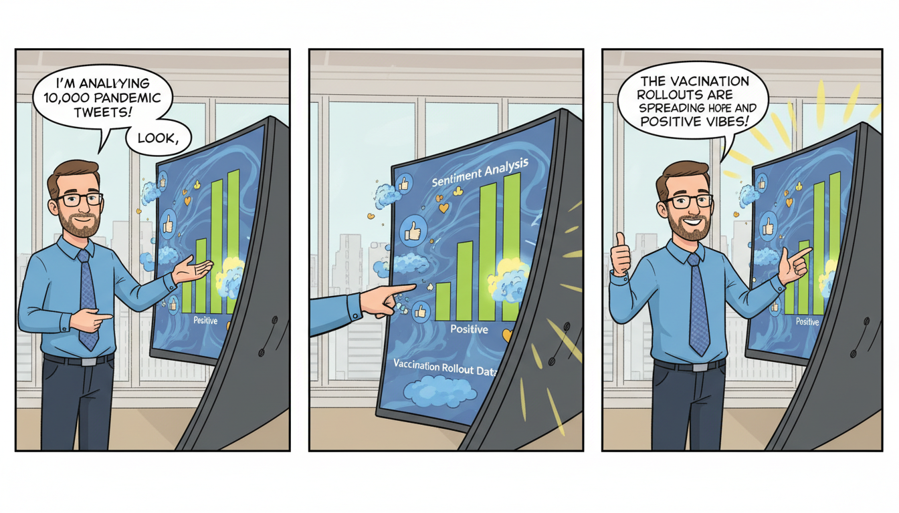

This is a professional and comprehensive `README.md` based on your project details.

---

# Tweet Sentiment Analysis: COVID-19 Trends


## 📌 Project Overview
This repository contains a comprehensive sentiment analysis of 10,000 tweets extracted during a critical period of the COVID-19 pandemic. The project aims to understand the public's emotional response during peak infection rates and explore whether external factors, such as vaccination rollouts, influence the general sentiment on social media.

Despite the high spread of the virus during the data collection period, the analysis reveals a surprising trend: **positive sentiment significantly offsets negative sentiment.**

## 📊 Key Findings
- **Sample Size:** 10,000 tweets.
- **Primary Observation:** Positive sentiment is more prevalent than negative sentiment.
- **Hypothesis:** The surge in positive sentiment may be attributed to the accelerated pace of global vaccination campaigns and the associated hope for a return to normalcy.
- **Variability:** Results are highly sensitive to the extraction date and sample size; shifting the timeframe may yield different emotional distributions.

## 🛠️ Technologies Used
- **Python**: Core programming language.
- **Pandas**: For data manipulation and cleaning.
- **TextBlob / VADER**: For Natural Language Processing (NLP) and sentiment scoring.
- **Matplotlib / Seaborn**: For data visualization and plotting sentiment distributions.
- **Tweepy**: (Implicit) Used for interacting with the Twitter API.

## 📂 Repository Structure
```bash
.
├── README.md               # Project documentation
└── tweets_prueba1.ipynb    # Main Jupyter Notebook with data processing and analysis
```

## 🚀 Getting Started

### Prerequisites
Ensure you have Python installed. It is recommended to use a virtual environment.

```bash
pip install pandas matplotlib seaborn textblob
```

### Usage
1. Clone the repository:
   ```bash
   git clone https://github.com/your-username/data_analysis-tweets-Sentiment-Analysis.git
   ```
2. Navigate to the directory:
   ```bash
   cd data_analysis-tweets-Sentiment-Analysis
   ```
3. Open the Jupyter Notebook:
   ```bash
   jupyter notebook tweets_prueba1.ipynb
   ```

## 📝 Code Example
The sentiment analysis follows a standard NLP pipeline. Here is a simplified look at how sentiments are categorized in the notebook:

```python
from textblob import TextBlob

def analyze_sentiment(tweet):
    analysis = TextBlob(tweet)
    # Determine sentiment based on polarity
    if analysis.sentiment.polarity > 0:
        return 'Positive'
    elif analysis.sentiment.polarity == 0:
        return 'Neutral'
    else:
        return 'Negative'

# Example Application
df['sentiment'] = df['tweet_text'].apply(analyze_sentiment)
print(df['sentiment'].value_counts(normalize=True))
```

## 📈 Visualizing Results
The project includes visualizations that compare the density of positive, neutral, and negative tweets. These plots help illustrate how "hopeful" content (vaccination progress) competes with "alarming" content (infection rates) in the public discourse.

## 🔍 Future Work
- **Temporal Analysis:** Expand the dataset to compare sentiments across different months of the pandemic.
- **Geographic Filtering:** Analyze if sentiments vary significantly between different countries or regions.
- **Keyword Correlation:** Identify which specific terms (e.g., "vaccine", "lockdown", "booster") drive the most positive or negative engagement.

---
**Author:** [Your Name/GitHub Profile]
**Project Date:** October 2023 (or appropriate date)